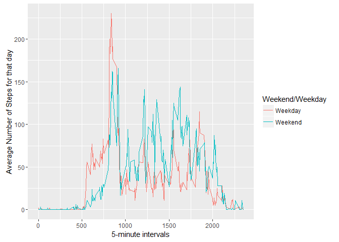

# Reproducible Research: Peer Assessment 1 - Taha Jirjees


## Loading the Data
In this section we load our data into R. 

```r
filePath <- "P:/Work/CourseraProjectWork/Reproducable Research/activity.csv"
data <- read.csv(filePath, header = TRUE)
```

### Pre-processing
After data has been loaded, some pre-processing is done to ensure that date column is read in correct format. 

```r
data$date <- as.Date(data$date)
```

## What is mean total number of steps taken per day?
### Histogram of the total number of steps taken each day
Using the dplyr library, we're able to group steps data by date. We can then plot this data in the form of a histogram using gglot2 library. 

```r
library(dplyr)
```

```
## 
## Attaching package: 'dplyr'
```

```
## The following objects are masked from 'package:stats':
## 
##     filter, lag
```

```
## The following objects are masked from 'package:base':
## 
##     intersect, setdiff, setequal, union
```

```r
library(ggplot2)

#seperate out sum of steps per date
stepsByDay <- data %>% filter(!is.na(steps)) %>% group_by(date) %>% summarise(steps = sum(steps))

#plot
qplot(steps, data= stepsByDay, geom = "histogram")
```

```
## `stat_bin()` using `bins = 30`. Pick better value with `binwidth`.
```

\

### Mean and Median of the total number of steps taken per day
We can use the mean and median functions on the steps columns of our 'stepsByDay' dataframe to compute the mean and median values of steps taken per day. 


```r
mean(stepsByDay$steps)
```

```
## [1] 10766.19
```

```r
median(stepsByDay$steps)
```

```
## [1] 10765
```


## What is the average daily activity pattern?
### Time Series Plot of number of steps in 5-min intervals
Using a similar process to how we grouped data of steps according to date, we'll now group them by interval to find the number of steps taken in each interval. Once we have this data, we can plot a time series for it using the ggplot2 library.  

```r
#seperate out sum of steps per interval
stepsByInterval <- data %>% filter(!is.na(steps)) %>% group_by(interval) %>% summarise(steps = sum(steps))

#plot
ggplot(stepsByInterval, aes(interval,steps)) + geom_line() + xlab("5-minute Intervals") + ylab("Average Number of Steps per Day")
```

\

### Maximum number of steps in a 5-min interval
To figure out which 5-min interval had the most number of steps we'll subset our dataframe at the row where steps returns the maximum value.

```r
maxInterval <- stepsByInterval[which.max(stepsByInterval$steps),]
maxInterval[,1]
```

```
## Source: local data frame [1 x 1]
## 
##   interval
##      (int)
## 1      835
```


## Imputing missing values
### Number of NA values

```r
dataNA <- data[is.na(data),]
count(dataNA)
```

```
## Source: local data frame [1 x 1]
## 
##       n
##   (int)
## 1  2304
```

### Replacing Missing Values
Strategy to replace missing values will be to replace each NA value with a mean value of the number of steps in that particular interval

```r
meanstepsByInterval <- data %>% filter(!is.na(steps)) %>% group_by(interval) %>% summarise(meansteps = as.integer(mean(steps)))

dataNA$steps <- sapply(dataNA$interval, function(x){
  meanstepsByInterval$meansteps[which(meanstepsByInterval$interval == x)]
})
```

### New Dataset with Missing Values filled in

```r
newData <- data 
newData[is.na(newData),1] <- dataNA$steps

newstepsByDay <- newData %>% filter(!is.na(steps)) %>% group_by(date) %>% summarise(steps = sum(steps))

#plot 
qplot(steps, data= newstepsByDay, geom = "histogram")
```

```
## `stat_bin()` using `bins = 30`. Pick better value with `binwidth`.
```

\


### Mean and Median of steps with Missing Values filled in

```r
#mean and median 


mean(newstepsByDay$steps)
```

```
## [1] 10749.77
```

```r
median(newstepsByDay$steps)
```

```
## [1] 10641
```
We can see from these values that while a deviation about the mean has been minimum, the median value has shifted by about hundred steps give or take. 


## Are there differences in activity patterns between weekdays and weekends?

```r
for(i in 1:nrow(newData)){
  ifelse(weekdays(newData[i,2]) %in% c("Saturday", "Sunday"), newData[i,4] <- "Weekend",newData[i,4] <- "Weekday")
}


meanstepsByDay <- newData %>% group_by(V4, interval) %>% summarise(meansteps = as.integer(mean(steps)))

#plot
ggplot(meanstepsByDay, aes(x=interval, y=meansteps, color = V4)) +
  geom_line() + xlab("5-minute intervals") + ylab("Average Number of Steps for that day") + labs(color = "Weekend/Weekday")
```

\

